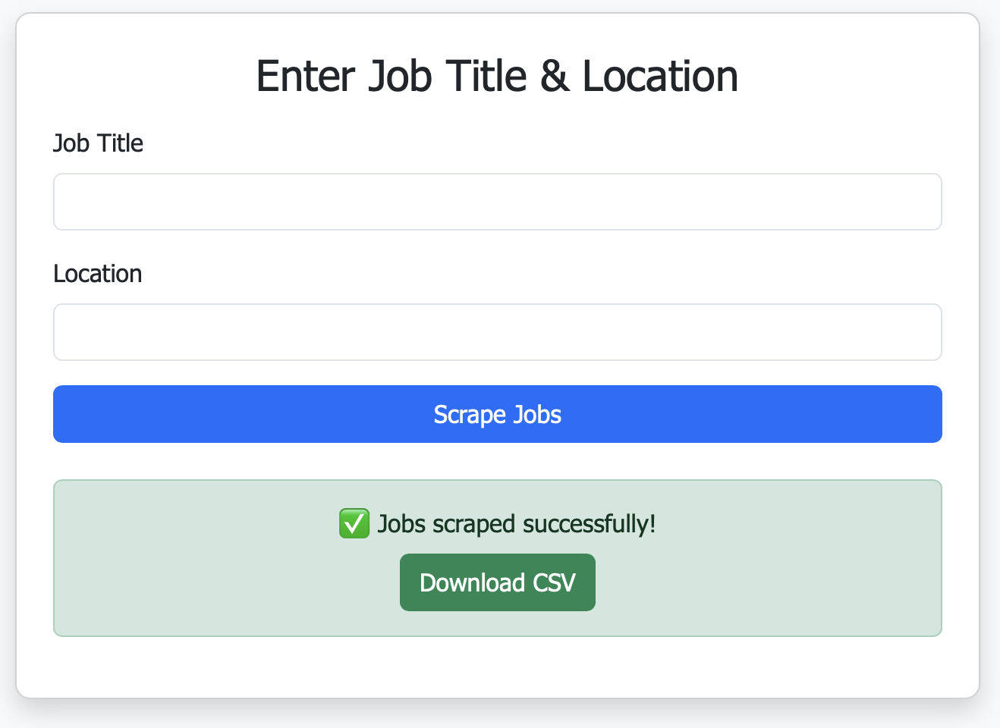

# ScrapeHire

**ScrapeHire** is a simple and elegant web application that scrapes job listings directly from LinkedIn using job title and location inputs — and lets users instantly download the results as a CSV.

---

##  Features

-  Scrape real-time LinkedIn job listings
- ️ Input job title and location from a simple form
-  Download results as a CSV instantly
-  Responsive and modern web design
-  Feedback spinner while scraping is in progress
-  No login or API required

---


## Tech Stack

- **Python 3.12+**
- **Flask**
- **BeautifulSoup**
- **Requests**
- **Bootstrap 5**

---

#### Installation
Some simple steps to get started:
```bash
git clone https://github.com/anuragraturi114/ScrapeHire
cd ScrapeHire
pip install -r requirements.txt
```


Run the web app
```bash
python app.py
```

Then open in browser and click on the link


---

##  Web Interface Preview

### 1. Homepage
- Click on the "Get started" button


### 2. Job Input Form
- Enter Job Details
- Type the Job Title (e.g., Data Scientist)
- Type the Location (e.g., Delhi)


### 3. Success Message + Download
- Takes 10–20 seconds depending on the number of job
- After success, a Download CSV button will appear.
- Click to save the LinkedIn job listings to your device.




---

## Notes
	
- **This project is intended for educational/demo use only.**
- **Scraping LinkedIn directly can be rate-limited or blocked; use responsibly.**
